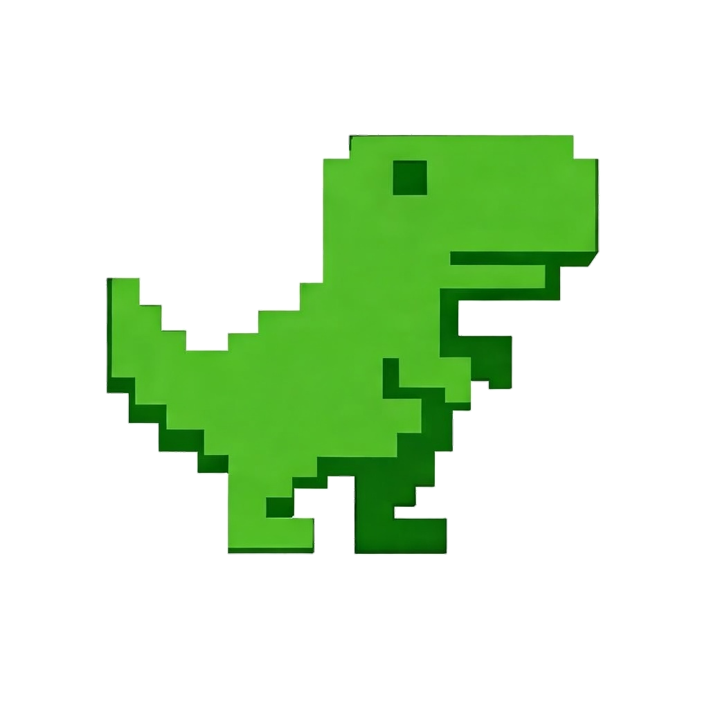

<div align="center">
  <a>
    
  </a>

  # **Trex Panel - Next.js Refactor**
</div>

This is a modern dashboard application built with Next.js 14 for managing proxy panels (Xray/V2Ray/SS).
```

c:\Users\Ali\Desktop\Trex-panel\README.md
```markdown
<<<<<<< SEARCH
---


## ✨ Features

| Feature | Description |
|---------|-------------|
| 🔐 **Role-Based Access** | SuperAdmin & Admin roles with granular permissions |
| 📊 **Unified Dashboard** | Monitor all panels from a single interface |
| 👥 **User Management** | Create, edit, and manage users across panels |
| 📈 **Traffic Monitoring** | Real-time traffic statistics and limits |
| 🔄 **Auto Sync** | Automatic synchronization with X-UI panels |
| 🌙 **Dark/Light Mode** | Beautiful UI with theme support |
| 🐳 **Docker Ready** | One-command deployment |
## 🎯 Features

- Modern UI with Tailwind CSS
- Authentication system
- Admin management
- Panel management
- Dashboard with statistics
- Responsive design

## 🛠️ Tech Stack

- Next.js 14 with App Router
- React 18
- TypeScript
- Tailwind CSS
- Radix UI Primitives
- Lucide React Icons


---

## 🎯 Overview

A comprehensive admin dashboard system for managing X-UI panels with role-based access control (SuperAdmin and Admin roles).

---

## ✨ Features

| Feature | Description |
|---------|-------------|
| 🔐 **Role-Based Access** | SuperAdmin & Admin roles with granular permissions |
| 📊 **Unified Dashboard** | Monitor all panels from a single interface |
| 👥 **User Management** | Create, edit, and manage users across panels |
| 📈 **Traffic Monitoring** | Real-time traffic statistics and limits |
| 🔄 **Auto Sync** | Automatic synchronization with X-UI panels |
| 🌙 **Dark/Light Mode** | Beautiful UI with theme support |
| 🐳 **Docker Ready** | One-command deployment |

---


## ⚡ Quick Start

### One-Line Install

```bash
bash <(curl -s https://raw.githubusercontent.com/thugbit/Trex-panel/main/install.sh)
```


## 🔄 Management Commands

After installation, use these commands:

| Command | Description |
|---------|-------------|
| `trex-panel update` | Pull latest image & restart |
| `trex-panel start` | Start the panel |
| `trex-panel stop` | Stop the panel |
| `trex-panel restart` | Restart the panel |
| `trex-panel logs` | View live logs |
| `trex-panel uninstall` | Remove completely |

---
### Manual Installation

```bash
git clone https://github.com/thugbit/Trex-panel.git
cd Trex-panel
cp .env.example .env  # Configure your settings
docker compose up -d
```

---

## 💰 Support

This project is maintained by thugbit and does not accept donations or sponsors at this time.


---

## 🤝 Contributing

Contributions are welcome! Feel free to open issues or submit pull requests.

---


<div align="center">
  <sub>Built with ❤️ by <a href="https://t.me/GrayCocaine">thugbit</a></sub>
</div>